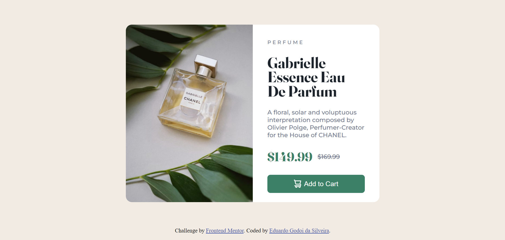

# Frontend Mentor - Product preview card component solution

This is a solution to the [Product preview card component challenge on Frontend Mentor](https://www.frontendmentor.io/challenges/product-preview-card-component-GO7UmttRfa). Frontend Mentor challenges help you improve your coding skills by building realistic projects. 

## Table of contents

- [Overview](#overview)
  - [The challenge](#the-challenge)
  - [Screenshot](#screenshot)
  - [Links](#links)
- [My process](#my-process)
  - [Built with](#built-with)
  - [What I learned](#what-i-learned)
  - [Continued development](#continued-development)
  - [Useful resources](#useful-resources)
- [Author](#author)
- [Acknowledgments](#acknowledgments)

**Note: Delete this note and update the table of contents based on what sections you keep.**

## Overview

### The challenge

Users should be able to:

- View the optimal layout depending on their device's screen size
- See hover and focus states for interactive elements

### Screenshot



### Links

- Solution URL: [Add solution URL here](https://github.com/GodoiTheCreator/ProductPreviewCard)
- Live Site URL: [Add live site URL here](https://godoithecreator.github.io/ProductPreviewCard/)

## My process

### Built with

- Semantic HTML5 markup
- CSS custom properties
- Flexbox

### What I learned

In this project I was able to get more experience in HTML and CSS's semantic and behavior, so it could be done in a short period of time, considering my experience in front-end development. I'm trying to use flexbox a lot because I think this is a great way to develop this type of websites.
I also learned how to change between images when I want to change to mobile or desktop, using display's properties to hide one of them.


```html
    <div class="imagem">
      
      
    </div>
```
```css
    .container .imagem .imgMobile {
        display: block;
    }

    .container .imagem .imgDesktop {
        display: none;
    }
```

### Continued development

I'll try to learn more about flexbox and css grid, so I can crate more websites faster, also want to acquire some knowledge about colors and design patterns in CSS and HTML, trying to be a better designer as well as a great developer.


### Useful resources

- [A Complete Guide to Flexbox](https://css-tricks.com/snippets/css/a-guide-to-flexbox/) - This helped me to use flexbox in this project. I really liked this article and will use it going forward.

## Author

- Linkedin - [Eduardo Godoi da Silveira](https://www.linkedin.com/in/eduardo-godoi/)
- Frontend Mentor - [@GodoiTheCreator](https://www.frontendmentor.io/profile/GodoiTheCreator)
- GitHub - [GodoiTheCreator](https://github.com/GodoiTheCreator)


